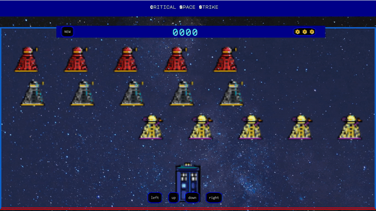
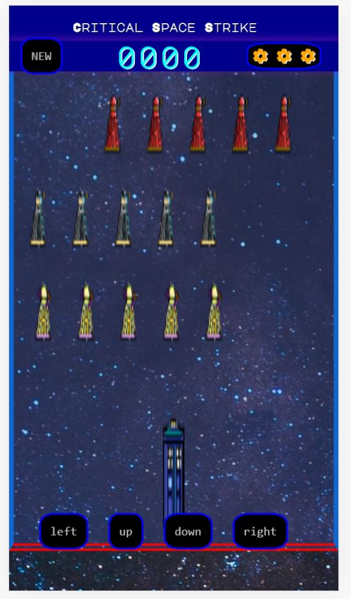

 
# Chingu Solo Project - Tier 1 - Critical Space Strike Game

## -WARNING- Before you take on this project, know that the frame rates, and animation process can produce effects similar to strobe lights,  if you have any sensitivity to these things, especially with seizures proceed with extreme caution.
Also be aware of producing a strobe lighting effect as you create it, even if you are unaffected, this may hurt someone who plays your game. Strobe light effects should not be used in any way. 
[Strobe light on wikipedia](https://en.wikipedia.org/wiki/Strobe_light)

## Goal
Create an old school arcade style game template in which the player object/image can be moved by the user in a restricted game area, and three rows of enemy objects/images that shift from one side of the game area to the the other in a loop/repeating pattern.
Most importantly have fun.

  

  

## Specifications
* Use CSS HTML and JavaScript (*no frameworks*)
* Player and enemy objects/images should resize or fit in game screen on all device screen sizes. 
* The game area should cover most of the screen.  
* A nav bar/header should give the name of the game and include:
   - [ ] Display a New Game button
   - [ ] A score of some sort(not required to be altered in gameplay)
   - [ ] some images/objects that represent the number of lives the player has.
* There should be one player/user item in the game area that can be controlled in two ways.  
   - [ ] desktop: key presses (this can include the buttons for mobile, but movement should be capable in both ways)
   - [ ] mobile: buttons
 
* Player item movement should stay within the game area at all times. The Player item should not be able to cross paths with the enemy items.
* Three rows of enemy items. Each row should contain at least five enemies.
   - [ ] Each row of enemies should move as the game runs in a repetatitive, or looping manner horizontally across the game screen.
   - [ ] Enemy item movement should be restricted to thier individual rows, and not leave the game screen area. 
   - [ ] The rows should not cross, or animation conflict in anyway with player item movement.
* Documentation / Error handling: 
   - [ ] Your repo needs to have a robust README.md
   - [ ] Make sure that there are no errors in the developer console before submitting
 
  

  
  

  
  ## More(Optional)
  
  * There is an assets file in this repo for images if you so choose.  You can use whatever image you wish for your player and enemy, but enemys should have a variety of three distinct visual types.  They can be apples, oranges and bananas if you really wish, but that's a lot of fruit. The player object/image can be a ship, or even a fruit bat if you want.  I mean, there is a lot of fruit. 
  
 It is ok if your game resets on refresh.  If you complete the project in plenty of time and wish to add bonus features, here are some suggestions:
 
 - [ ] A game start screen, so that the game only starts after player/user pushes some kind of 'start game' button.
 - [ ] A pause button.   A button that in some way stops the animation in process, disables the player movement, and upon 'un-pausing' The animation resumes from it's paused position. 
 - [ ] If you have even more time, tier two may be right for you.  
 - [ ] Feel free to write the animation process for the 'enemy' with CSS. If you are not familiar with Game mechanics, coordinate systems and data structures, the animation process with JavaScript can be challenging.  If you wish to try this out, after you have a working version to submit, don't let your working submission get lost.  Make a new repo for your challenge mode submission.
